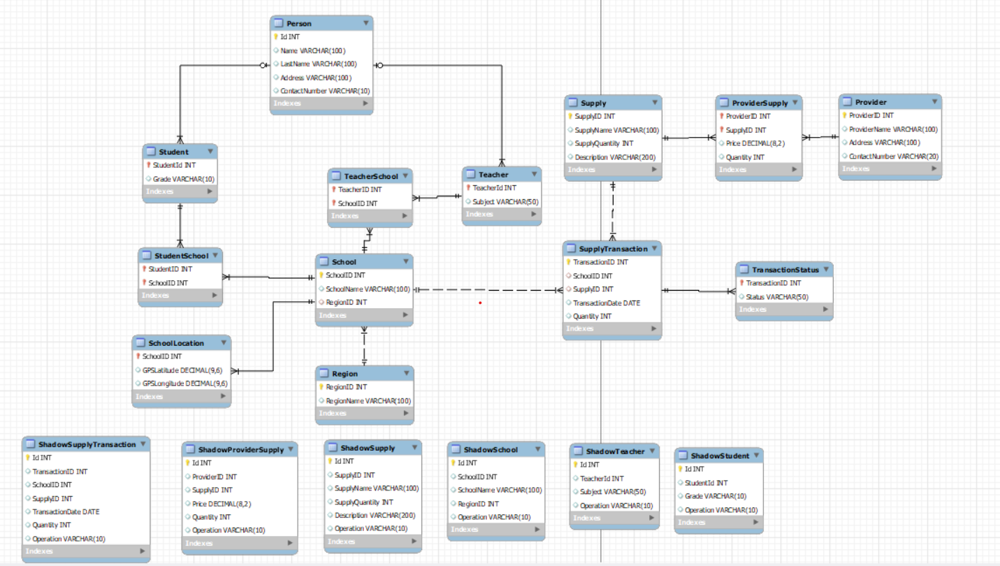

# Servicio de Elaboración de un Sistema Informático Geográfico y el Inventario de Establecimientos Educativos de la Provincia Cercado

En este repositorio se encuentra la documentación y código relacionado con el proyecto de base de datos destinado a gestionar el inventario de establecimientos educativos en la provincia de Cercado. El objetivo principal de este servicio es proporcionar una solución eficiente para mantener un registro preciso de los recursos y suministros de las unidades educativas, así como facilitar la gestión y seguimiento de los mismos.

### Gobierno Autónomo Municipal de Tarija

El Gobierno Autónomo Municipal de Tarija es la entidad encargada de la administración y gestión de los asuntos locales en el municipio de Tarija. Su objetivo es brindar servicios eficientes y mejorar la calidad de vida de los ciudadanos a través de diferentes iniciativas y proyectos.

### Requerimientos del Proyecto

- Diseño de una base de datos para el registro de inventario y ubicación geografica de unidades educativas presentes en la provincia de Cercado
- Tablas y Columnas: Se crearon 13 tablas para la representacion y esquematizacion del sistema de inventario y 6 tablas de auditoria para el registro de operaciones realizadas sobre la base de datos
- Relaciones entre Tablas: Se establecieron relaciones entre las tablas mediante claves primarias y claves foráneas para garantizar la integridad referencial y la consistencia de los datos.
- Creacion de 5 Store Procedures para la ejecucion de tareas frecuentes
- Creacion de 5 triggers para la automatizacion y validacion en la base de datos
- Creacion de triggers para el manejo de las tablas de auditoria
- Utilizacion de indices para la optimizacion de consultas
- Creacion de un contenedor mysql que albergue la base de datos
- Automatizacion de la creacion de los contenedores utilizando la herramienta de docker-compose

## Diagrama propuesto de la Base de Datos



### Estructura de contenedores

| Contenedor | Base de Datos    | Contraseña |
| ---------- | ---------------- | ---------- |
| schools    | school_inventory | password   |

## Requisitos Tecnicos

**Mac**
Para ejecutar un archivo Docker Compose en Mac, es necesario tener instalado Docker Desktop. Docker Desktop proporciona Docker Engine y Docker Compose. Requiere macOS 10.13 o posterior y es compatible con procesadores Intel y Apple Silicon. Asegúrate de tener Docker Desktop instalado y configurado correctamente en tu Mac antes de ejecutar Docker Compose.

**Windows**
Para ejecutar un archivo Docker Compose en Windows, se requiere Docker Desktop. Docker Desktop es compatible con Windows 10 de 64 bits: ediciones Pro, Enterprise o Education, con Microsoft Hyper-V habilitado. Asegúrate de instalar y configurar correctamente Docker Desktop en tu máquina con Windows antes de utilizar Docker Compose.

**Linux**
En Linux, para ejecutar un archivo Docker Compose, es necesario instalar Docker Engine y Docker Compose por separado. Docker Engine se puede instalar en varias distribuciones de Linux, y Docker Compose se puede instalar utilizando pip o como un archivo binario independiente. Consulta la documentación oficial de Docker para obtener instrucciones detalladas de instalación y conocer la compatibilidad de versiones específicas con tu distribución de Linux.

## Como levantar localmente

Para la ejecucion y levantamiento de los contendores primero es necesario clonar el repositorio

```bash
git clone https://github.com/SebastianRojas627/school_inventory_2_BDA.git
```

Una vez que los archivos hayan sido extraidos es necesario ejecutar el archivo de configuracion de docker compose

```bash
docker-compose up
```

Este comando levanta los contenedores y crea la base de datos, para acceder a cada contenedor se ejecutan los siguientes comandos:

- Para acceder al contenedor

```bash
docker-compose exec schools bash
```

- Para acceder a la base de datos

```bash
mysql -uroot -ppassword
```
